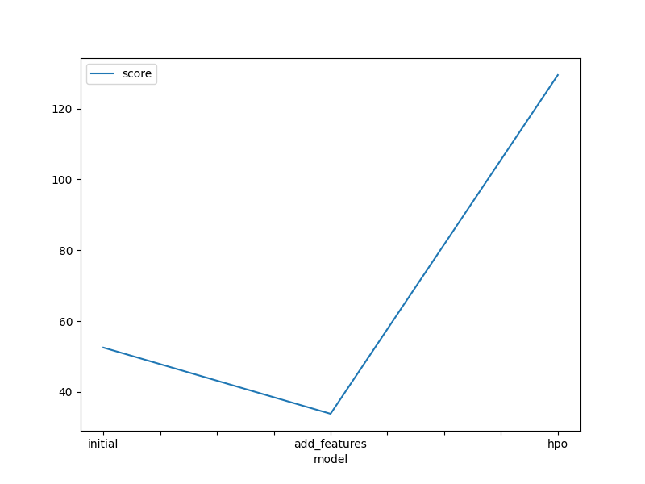

# Report: Predict Bike Sharing Demand with AutoGluon Solution
#### Amel Azib

## Initial Training
### What did you realize when you tried to submit your predictions? What changes were needed to the output of the predictor to submit your results?
Initial Raw Submission [Model: initial]
Added Features Submission (EDA + Feature Engineering) [Model: add_features]
Hyperparameter Optimization (HPO) - Initial Setting Submission [Model: hpo]
Observation: While submitting predictions obtained from the three experiments, some of the experiments delivered negative predictions values.
Changes incorporated: Kaggle refuses the submissions containing negative predictions values obtained from the predictor. Therefore, all negative outputs from respective predictors were replaced with 0.

### What was the top ranked model that performed?
The top-ranked model was the (add features) model named "WeightedEnsemble_L3",
with the best validation RMSE among the three scored 33.828 and the best Kaggle score of 0.46 (on test dataset). 
This model was developed by training on data obtained using exploratory data analysis (EDA) 
and feature engineering without the use of a hyperparameter optimization routine.
Upon hyperparameter-optimization, some models did show improved RMSE scores on validation data;
however this model delivered the best score on validation dtaa and the best performance on unseen test dataset. 

## Exploratory data analysis and feature creation
### What did the exploratory analysis find and how did you add additional features?
During the exploratory analysis, I discovered various insights and made several modifications to enhance the feature set. Firstly, I parsed the "datetime" feature as a datetime feature to extract the hour information from the timestamp. This allowed me to obtain a more precise representation of time.

Next, I observed that the independent features "season" and "weather" were initially read as integers. However, since these variables are categorical in nature, I transformed them into the category data type. This ensured that their categorical nature was properly captured in the analysis.

To further enrich the feature set, I performed feature extraction on the "datetime" feature. Specifically, I extracted the year, month, day (day of the week), and hour as distinct independent features. After extracting these features, the original "datetime" feature was dropped from the dataset as it was no longer needed.

Upon careful evaluation of the features, I found that the "casual" and "registered" features exhibited a significant improvement in the root mean square error (RMSE) scores during cross-validation. It was also observed that these independent features were highly correlated with the target variable, "count." However, it was noted that these features were only present in the train dataset and absent in the test data. Consequently, to ensure consistency, these features were ignored or dropped during the model training phase.

Additionally, I introduced a new categorical feature called "day_type." This feature was derived from the existing features "holiday" and "workingday" and effectively categorized the data into "weekday," "weekend," and "holiday" categories. The inclusion of this feature provided a more comprehensive representation of the data and facilitated more nuanced analysis and modeling.

### How much better did your model preform after adding additional features and why do you think that is?
The addition of additional features significantly enhanced the performance of the model compared to the initial/raw model that did not include exploratory data analysis (EDA) and feature engineering.

One reason for the improved performance was the conversion of certain categorical variables with integer data types into their true categorical data types. By accurately representing the categorical nature of these variables, the model could capture the inherent relationships and patterns within these features more effectively, leading to improved predictions.

Furthermore, the decision to ignore the "casual" and "registered" features during model training, and also dropping the "atemp" feature due to its high correlation with another independent variable, "temp," played a role in enhancing model performance. By removing these variables, the issue of multicollinearity was addressed, which can cause instability and inaccuracies in the model's predictions.

Moreover, splitting the "datetime" feature into multiple independent features such as year, month, day, and hour, along with the addition of the "day_type" feature, further contributed to the improved model performance. These additional predictor variables provided the model with more comprehensive information about seasonality and historical patterns in the data. This allowed the model to better capture and understand the underlying trends and dynamics, leading to more accurate predictions.

Overall, the incorporation of additional features and the thoughtful consideration of feature engineering techniques resulted in a substantial improvement in the model's performance.

## Hyper parameter tuning
### How much better did your model preform after trying different hyper parameters?
Hyperparameter tuning played a crucial role in enhancing the model's performance compared to the initial submission. However, it was observed that the model with exploratory data analysis (EDA) and added features performed exceptionally better on the Kaggle (test) dataset compared to the hyperparameter-optimized models.

Several observations were made during the process of hyperparameter tuning. Firstly, it was noted that the performances of the hyperparameter-optimized models were sub-optimal. This was attributed to the fixed set of hyperparameter values provided by the user, which limited the options that the autogluon package could explore. In other words, the hyperparameters were not fully optimized due to the predefined set of values.

Additionally, it was found that certain parameters, such as 'time_limit' and 'presets', played a crucial role in the hyperparameter optimization process using autogluon. The 'time_limit' parameter determined the duration within which autogluon could build models and find the optimal hyperparameters. If the time limit was insufficient, autogluon might fail to build any models or produce suboptimal results.

Moreover, it was observed that hyperparameter optimization with presets like "high_quality" (with auto_stack enabled) required high memory usage and were computationally intensive within the prescribed time limit and available resources. As a result, lighter and faster presets such as 'medium_quality' and 'optimized_for_deployment' were experimented with. In this context, the "optimized_for_deployment" preset, which prioritizes faster and lighter models, was preferred for the hyperparameter optimization routine.

Furthermore, a significant challenge encountered while using autogluon with a prescribed range of hyperparameters was the exploration versus exploitation trade-off. Finding the right balance between exploring different hyperparameter settings and exploiting the current best configuration posed a challenge. This trade-off was crucial for achieving optimal performance within the constraints of the hyperparameter search space.

In conclusion, while hyperparameter tuning improved the model's performance compared to the initial submission, the model with EDA and added features outperformed the hyperparameter-optimized models on the Kaggle dataset. Several factors, such as the fixed hyperparameter values, time limitations, and the exploration-exploitation trade-off, influenced the performance of the hyperparameter-optimized models using autogluon.

### If you were given more time with this dataset, where do you think you would spend more time?
If provided with more time to work with this dataset, I would focus on further exploring the capabilities of AutoGluon and conducting an extensive analysis of the model's performance. Specifically, I would allocate more time to run AutoGluon for an extended period, utilizing a high-quality preset and enhancing the hyperparameter tuning process.

By extending the runtime and utilizing a high-quality preset, I would allow AutoGluon to explore a wider range of hyperparameter configurations, potentially leading to improved model performance. This would involve conducting multiple iterations of hyperparameter optimization, adjusting the search space, and refining the hyperparameter values to find the best possible combination.

Additionally, I would perform a thorough analysis of the model's performance on various evaluation metrics, such as accuracy, precision, recall, and F1 score. This would provide a comprehensive understanding of the model's strengths and weaknesses, allowing for further refinement and improvement.

Furthermore, I would explore different feature engineering techniques to extract more meaningful insights from the dataset. This may involve creating new features, combining existing features, or applying advanced transformations to enhance the discriminative power of the predictors.

Moreover, given the availability of more time, I would conduct more extensive data exploration and analysis. This could involve delving deeper into the relationships between variables, identifying potential outliers or missing data, and identifying additional patterns or trends that could contribute to improved model performance.

Overall, with additional time, I would focus on maximizing the potential of AutoGluon by running it for an extended period with a high-quality preset and conducting a thorough analysis of the model's performance. This would involve refining the hyperparameter tuning process, exploring advanced feature engineering techniques, and conducting in-depth data exploration to uncover further insights.

### Create a table with the models you ran, the hyperparameters modified, and the kaggle score.
| model        | hpo1                                   | hpo2              | hpo3                  |   score |
| ------------- |:---------------------------------------|:------------------|:----------------------|:--------:|
| initial      | prescribed values                      | prescribed values | presets: best quality |    1.8  |
| add_features | prescribed values                      | prescribed values | presets: best quality |    0.46 |
| hpo          | Tree-Based Models: (GBM, XT, XGB & RF) | hyperparameters   | presets: good quality |    0.51 |

### Create a line plot showing the top model score for the three (or more) training runs during the project.

TODO: Replace the image below with your own.

### Create a line plot showing the top kaggle score for the three (or more) prediction submissions during the project.

TODO: Replace the image below with your own.

## Summary
Summary:

The bike sharing demand prediction project incorporated the AutoGluon AutoML framework for Tabular Data. AutoGluon's capabilities were fully utilized to create automated stack ensembles and individually configured regression models. The initial baseline model was quickly prototyped using AutoGluon.

The top-ranked model, which incorporated EDA and feature engineering, outperformed the AutoGluon-based models without hyperparameter optimization. However, hyperparameter tuning using AutoGluon did lead to improved performance compared to the initial raw submission.

Hyperparameter tuning with AutoGluon proved to be a challenging process. It required careful consideration of parameters such as time limit, presets, model families, and hyperparameter ranges. Default hyperparameters or random configurations were less effective in achieving optimal performance.

In conclusion, incorporating AutoGluon and utilizing its capabilities, including hyperparameter tuning, improved the model's performance. However, the model with EDA and feature engineering achieved the best results, highlighting the importance of thorough data analysis and feature engineering in model development.
